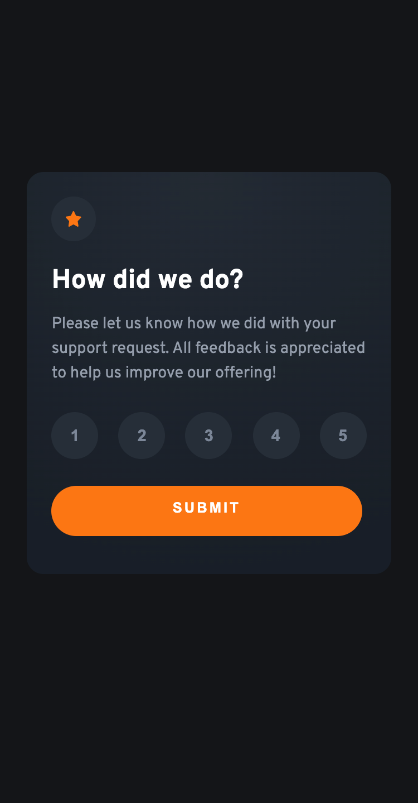

# Frontend Mentor - Interactive rating component solution

This is a solution to the [Interactive rating component challenge on Frontend Mentor](https://www.frontendmentor.io/challenges/interactive-rating-component-koxpeBUmI). Frontend Mentor challenges help you improve your coding skills by building realistic projects. 

## Table of contents

- [Frontend Mentor - Interactive rating component solution](#frontend-mentor---interactive-rating-component-solution)
  - [Table of contents](#table-of-contents)
  - [Overview](#overview)
    - [The challenge](#the-challenge)
  - [Screenshots](#screenshots)
    - [Mobile View](#mobile-view)
    - [Desktop View](#desktop-view)
  - [Built with](#built-with)
  - [Links](#links)
  - [Useful resources](#useful-resources)
  - [Author](#author)

---
## Overview

### The challenge

Users should be able to:

- View the optimal layout for the app depending on their device's screen size
- See hover states for all interactive elements on the page
- Select and submit a number rating
- See the "Thank you" card state after submitting a rating

---
## Screenshots

### Mobile View

### Desktop View

---
## Built with

- HTML5
- CSS
- CSS Flexbox
- JavaScript | getValue() & submitFunction()
- Mobile-first workflow

---
## Links

- Solution URL: [Github Code](https://github.com/VLOrozco/interactive-rating-component.git)

- Live Site URL: [Interactive Rating Component](https://vlorozco.github.io/interactive-rating-component/)

---
## Useful resources

- Output the value of multiple buttons in the console.log: [Stack Overflow](https://stackoverflow.com/questions/68680000/output-the-value-of-multiple-buttons-in-the-console-log)

---

## Author

- Github - [Veronica L. Orozco](https://github.com/VLOrozco)
- Frontend Mentor - [@VLOrozco](https://www.frontendmentor.io/profile/VLOrozco)
- Codecademy - [orozcov3](https://www.codecademy.com/profiles/orozcoV3)